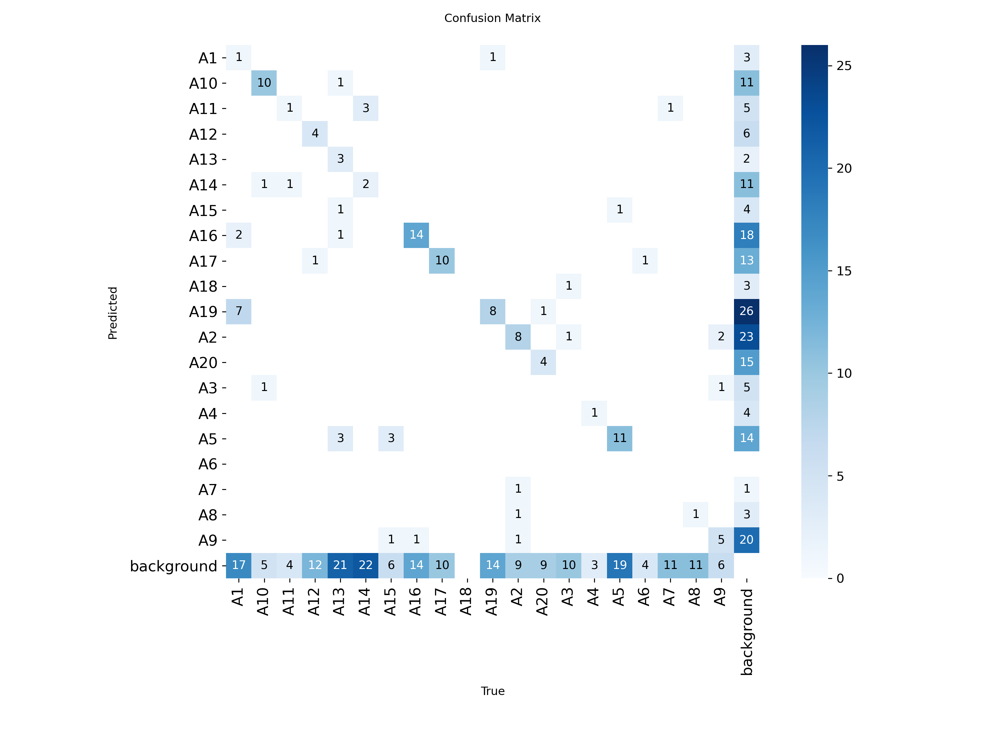
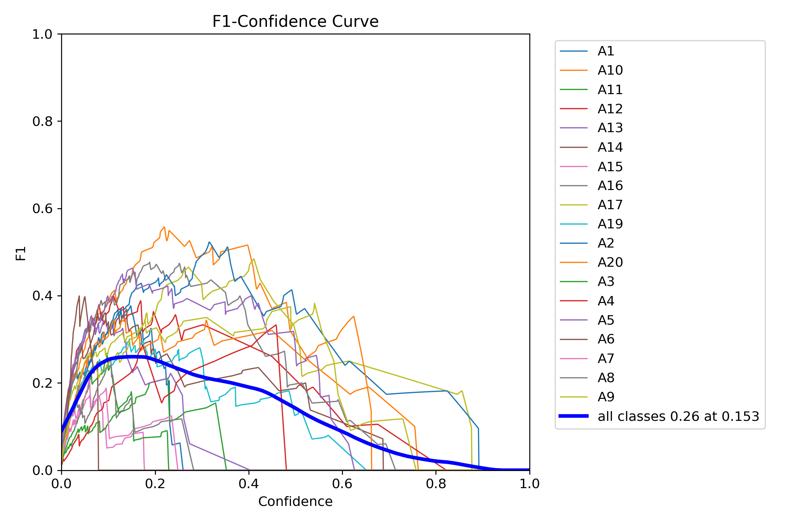
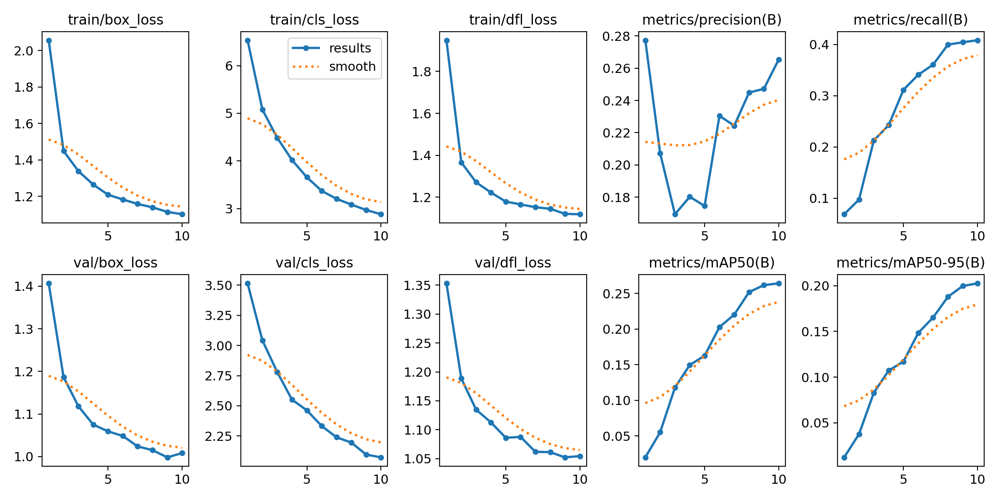
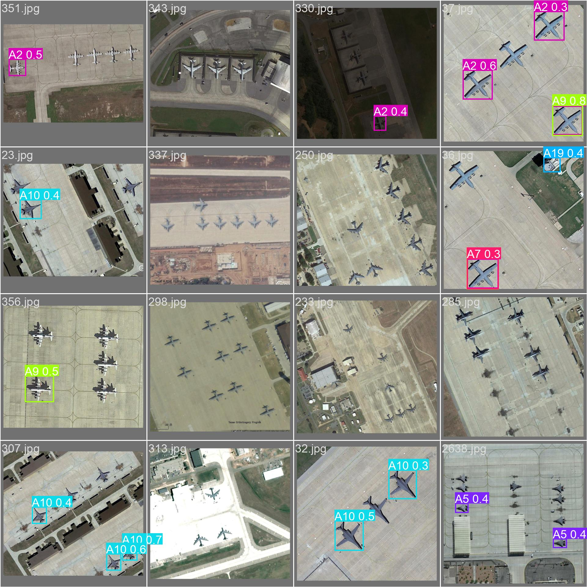
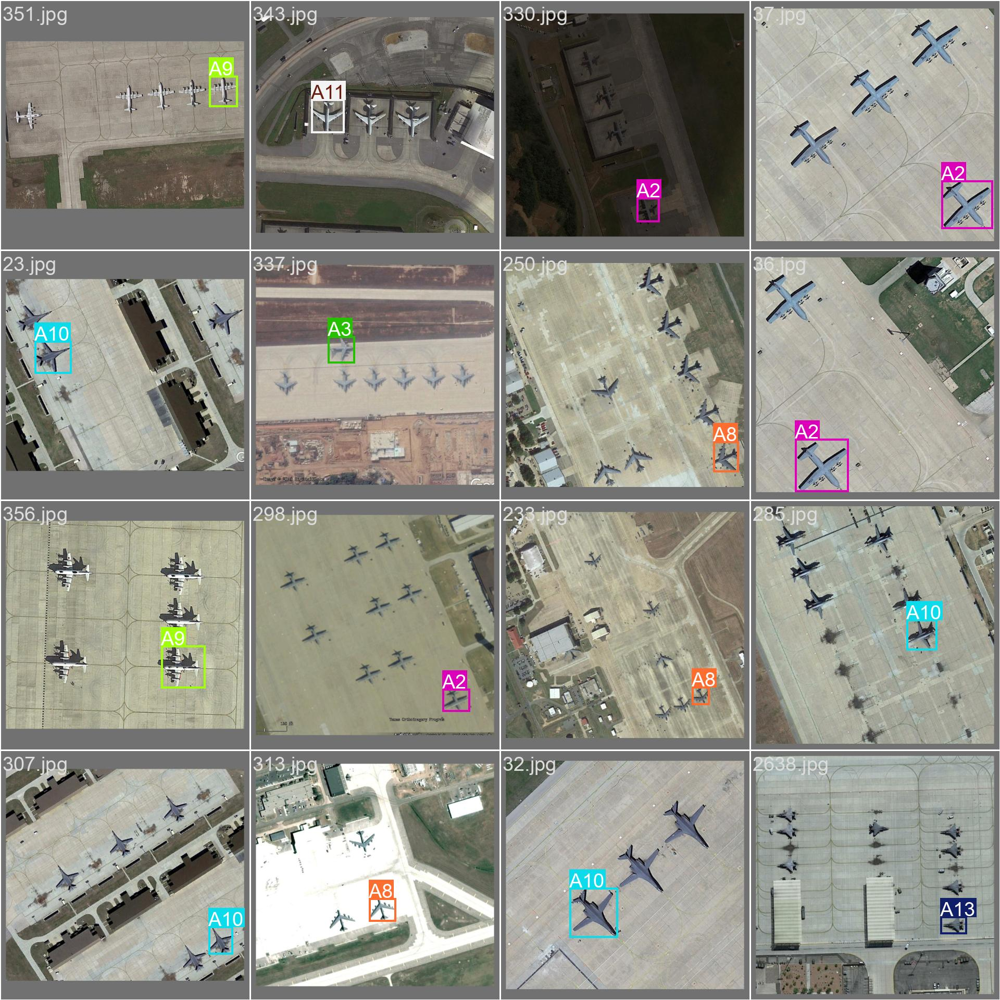

# Preliminary Results: Fine-tuned YOLOv8 on Military Aircraft Recognition

This directory contains preliminary results from fine-tuning the YOLOv8 model on the Military Aircraft Recognition dataset for 10 epochs.

## Results

## Example Predictions

## Reproducibility

The fine-tuning process and evaluation were performed using the notebook [`finetune_yolov8_military_aircraft.ipynb`](..\YOLO_content\MilitaryAircraft_ConvertDataToYolo.ipynb).

---
*These results are preliminary and based on a short training run (10 epochs).*