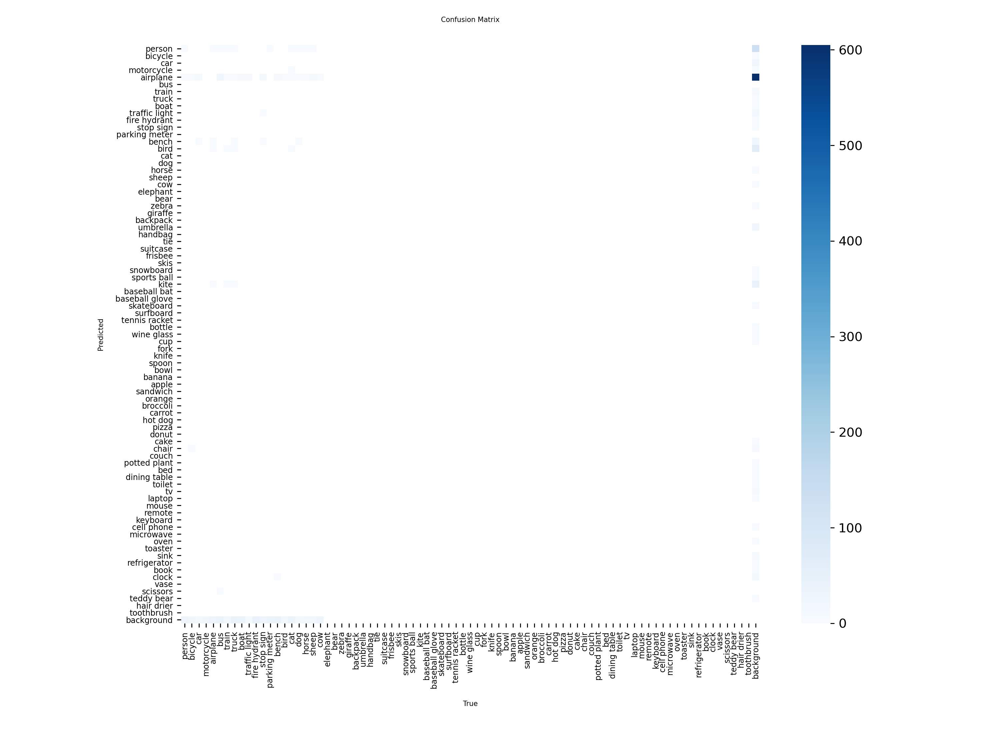
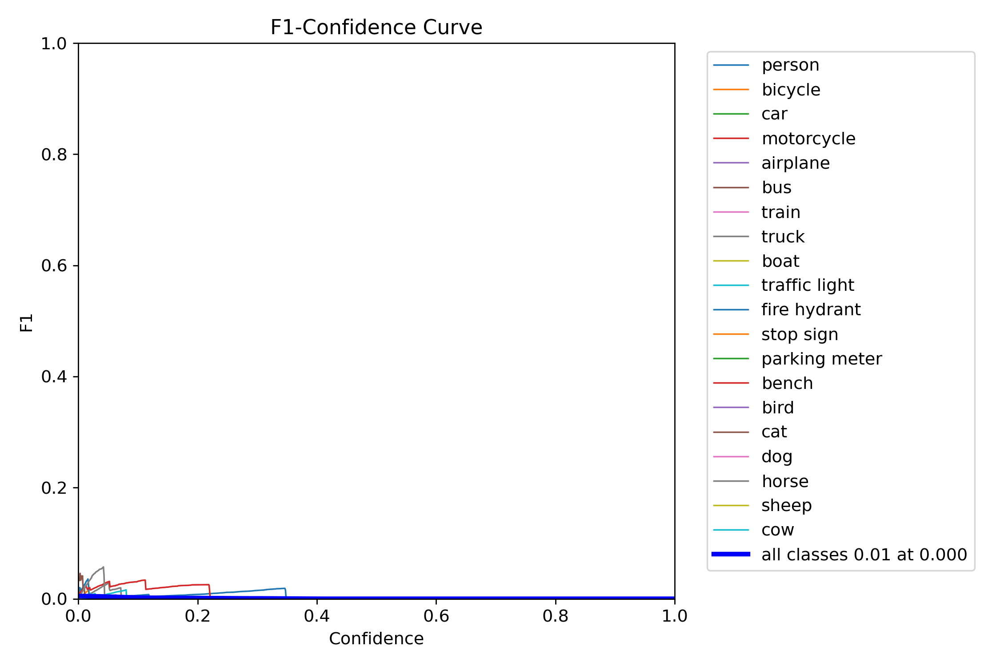
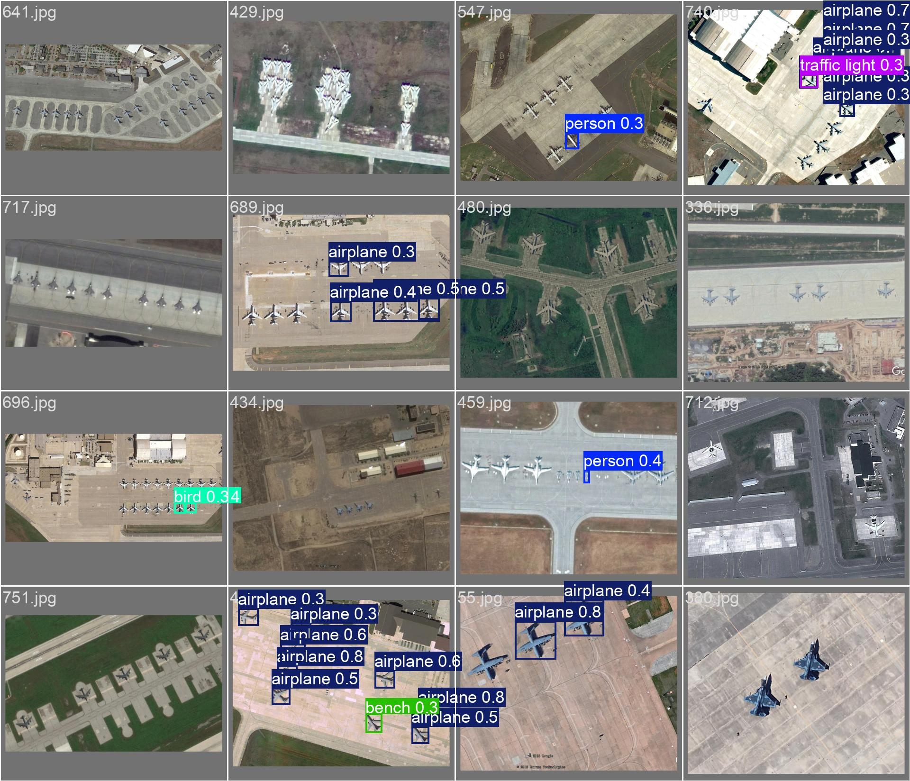

# ZeroShot Results: YOLOv8 on Military Aircraft Recognition

This directory contains results from zero shot of the YOLOv8 model on the Military Aircraft Recognition dataset.

Note the yolo model is trained on COCO which has 80 classes. None of these classes are present in the Military Aircraft Recognition dataset. Therefore, the model is expected to perform poorly.

## Results

## Example Predictions

## Reproducibility

The fine-tuning process and evaluation were performed using the notebook [`finetune_yolov8_military_aircraft.ipynb`](..\YOLO_content\MilitaryAircraft_ConvertDataToYolo.ipynb).